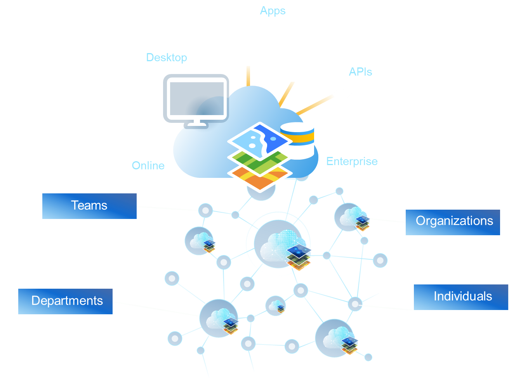
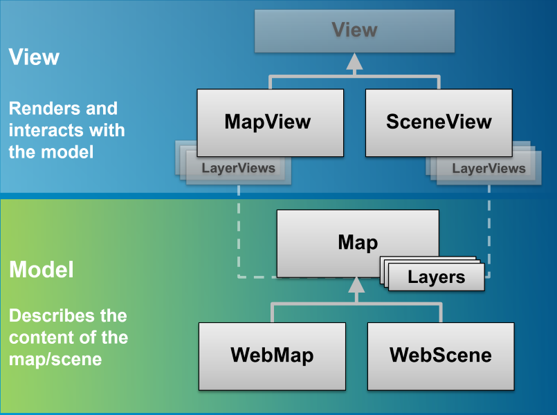

<!-- .slide: class="title" -->

<!-- .slide: data-background="./images/bg-1.png" -->
<!-- .slide: class="title" -->

<h1 style="text-align: left; font-size: 80px;">Building Apps</h1>
<h2 style="text-align: left; font-size: 60px;">with the ArcGIS API for JavaScript</h2>
<h2 style="text-align: left; font-size: 60px;">Berlin, 2019</h2>
<p style="text-align: left; font-size: 30px;">Rene Rubalcava</p>
    <p style="text-align: left; font-size: 30px;">slides: <a href="https://git.io/JezO1" target="_blank">https://git.io/JezO1</a></p>

<!--
Learn how to use ArcGIS API for JavaScript to build high-performing, engaging web applications. This course introduces the classes available in the API and how to use them in a JavaScript-based web application. You will also learn how to enhance your applications by incorporating ready-to-use content and ArcGIS services.

Prerequisites: Students are expected to be fairly comfortable and experienced with the basics of the JavaScript language at least at the intermediate level.
-->

---

<!-- .slide: class="agenda" -->

## Format

Demos and short labs

---

## Questions for you

How familiar are you with:

1. ArcGIS Online (maps, data, services, analysis)
2. ArcGIS API for JavaScript

---

<!-- .slide: class="agenda" -->

## Agenda

- Platform
- Data
- Design
- Develop

---

<!-- .slide: class="section" -->

# API Basics

---

<!-- .slide: class="section" -->

# ArcGIS Platform

---

<div style="width: 100%; display: table;">
    <div style="display: table-row">
    <div style="width: 60%; float: left;"> 
   <h3> Location Intelligence Everywhere </h3>
   <ul>
  <li>SaaS mapping and location platform</li>
  <li>Comprehensive GIS</li>
</ul>
     </div>
    <div style="width: 40%; float: right;"> 
        
    </div>
    
</div>

---

## ArcGIS Dev Process

---

## Getting set up

1. Sign up for FREE ArcGIS Developer Account
2. Explore some projects on esri.github.io
3. Explore ArcGIS.com

---

<!-- .slide: class="section" -->

# Overview

---

## Overview

- Focus on interactivity
- Performance
- Developer experience
- Modern JavaScript/TypeScript

---

## Overview

- Watch for property changes
- Native Promises
- Seperation of concerns
  - Model and View patterns

---

# SDK
- Built from scratch
- Simpler, focused samples
- Enhanced user experience
- Improved search functionality
- More guides and code snippets
- [link](https://developers.arcgis.com/javascript/)

---

<!-- .slide: class="section" -->

# Develop

---

## Your first map

```js
const map = new Map({
  basemap: "topo-vector"
});

const view = new MapView({
  container: "viewDiv",
  map: map,
  center: [-118.71511,34.09042],
  zoom: 10
});
```

---

## Exercise: Your first map

- [Create a starter app](https://developers.arcgis.com/javascript/latest/guide/create-a-starter-app/)

---

<!-- .slide: class="section" -->

# Basemaps

---

## Basemaps

- full fledge class `esri/Basemap`
- basemap's layers are _not_ part of the `map.layers`, but from `map.basemap`
- contains 2 Collections: `baseLayers`, `referenceLayers`
- can be set with
  - string for esri's basemap
  - or custom Basemap instance
  - in 2D and 3D

---

## Basemaps

- Base layers
  - Can be any layer that you want to treat as the base
  - Usually tiled layers
- Reference layers
  - Layers that are always on top of the map
  - Usually labels

---

## Basemaps

```js
  const map = new ArcGISMap({
    basemap: {
      baseLayers: [
        // base tiles
        new VectorTileLayer({...}),
        // detail tiles
        new VectorTileLayer({...})
      ],
      referenceLayers: [
        // labels
        new VectorTileLayer({...})
      ]
    },
    // operation layers
    layers: [layer]
  });
```

---

## Basemap
- `basemap` as a string, creation of the appropriated Basemap instance

```js
const map = new Map({
  basemap: 'topo'
});

map.basemap = 'streets';
```

- `basemap` as an instance of `Basemap`

```js
const map = new Map({/*...*/});

const toner = {
  baseLayers: [
    new WebTiledLayer({
      urlTemplate: '...'
    })
  ]
};

map.basemap = toner;
```

---

- `basemap` is loaded from a `WebMap`

```js
const map = new ArcGISMap({
  basemap: {
    portalItem: {
      id: "8d91bd39e873417ea21673e0fee87604"
    }
  }
});
```

---

## Basemaps

<iframe height="600" style="width: 100%;" scrolling="no" title="Basemap LayerList" src="https://codepen.io/odoe/embed/preview/QWWpxZv?height=300&theme-id=31222&default-tab=js,result" frameborder="no" allowtransparency="true" allowfullscreen="true">
  See the Pen <a href='https://codepen.io/odoe/pen/QWWpxZv'>Basemap LayerList</a> by Rene Rubalcava
  (<a href='https://codepen.io/odoe'>@odoe</a>) on <a href='https://codepen.io'>CodePen</a>.
</iframe>

---

## Exercise: Basemaps

- [Select a basemap](https://developers.arcgis.com/javascript/latest/guide/select-a-basemap/)

---

<!-- .slide: class="section" -->

# API Fundamentals

---

## Properties watching

- Direct benefits:
 - remove inconsistancies between constructor, getter, setter functions, events
 - one convention everywhere. _"just need to know what properties for a class"_
 - Single object constructor
 - Leaner SDK: we doc only the properties, the rest is convention

---

## Properties watching

```javascript
const map = new Map(...);
const view = new MapView({ map: map });

// watch for view scale updates
view.watch('scale', (newValue, oldValue, property, target) => {
  console.log(newValue, oldValue, property, target);
})

// chain watching
map.watch('basemap.title', (value) => {
  console.log(value);
});
map.basemap = 'topo';
```

---

- watchUtils

<iframe height='600' scrolling='no' title='watchUtils' src='//codepen.io/odoe/embed/preview/oeGmQN/?height=600&theme-id=31222&default-tab=js,result' frameborder='no' allowtransparency='true' allowfullscreen='true' style='width: 100%;'>See the Pen <a href='https://codepen.io/odoe/pen/oeGmQN/'>watchUtils</a> by Rene Rubalcava (<a href='https://codepen.io/odoe'>@odoe</a>) on <a href='https://codepen.io'>CodePen</a>.
</iframe>

---

## Unified Object Constructor

```js
require([
  'esri/Map',
  'esri/Basemap',
  'esri/core/Collection',
  'esri/layers/TileLayer'
],
function(
  Map,
  Basemap,
  Collection,
  TileLayer
) {
  const map = new Map({
    basemap: new Basemap({
      baseLayers: new Collection([
        new TileLayer({ url: url })
      ])
    })
  });
});
```

---

## Autocast

```js
require([
  'esri/Map',
  'esri/layers/TileLayer',
  'esri/views/MapView'
],
function(
  Map,
  TileLayer,
  MapView
) {
  const map = new Map({
    basemap: {
      baseLayers: [
        new TileLayer({ url: url })
      ]
    }
  });

  const view = new MapView({
    map: map,
    container: 'viewDiv',

    extent: {
      xmin: -180, xmax: 180,
      ymin: -80, ymax: -80,
      spatialReference: 4326
    }
  });
});
```

---

## Autocast

```js
  // 3.x
  new SimpleMarkerSymbol(SimpleMarkerSymbol.STYLE_SQUARE, 10,
    new SimpleLineSymbol(SimpleLineSymbol.STYLE_SOLID,
    new Color([255,0,0]), 4),
    new Color([255,255,255,0.25]));

  // 4.x
  {
    type: "simple",
    style: 'square',
    color: 'red',
    size: 10,

    outline: {
      color: 'rgba(255, 255, 255, 0.5)'
      width: 4
    }
  };
```

---

## More Autocast

```js
const marker = {
  type: "simple-marker",
  style: 'square',
  color: 'red',
  size: 10,

  outline: {
    color: 'rgba(255, 255, 255, 0.5)'
    width: 4
  }
};

const pointGraphic = new Graphic({
  geometry: {
    type: "point", // autocasts as new Point()
    longitude: -71.2643,
    latitude: 42.0909
  },
  symbol: marker // autocasts as new SimpleMarkerSymbol()
});
```

---

## Collection

 - Array-_like_ Container
 - in house methods `add` / `remove` ...
 - array methods `forEach` / `map` ...
 - newer array methods `find` / `findIndex`...
 - used for layers, used for layers in Basemap, used for graphics...

```js
const collection = new Collection([1, 2, 3]);
collection.add(5);
collection.addMany([6, 7]);
collection.forEach((item) => {
  console.log(item);
});
const even = collection.filter((item) => {
  return (item % 2) === 0;
});
collection.forEach((item) => {
  console.log(item);
});
```

---

## Collection

 - Emit `"change"` events when something is added/removed/moved

```js
const collection = new Collection([1, 2, 3]);
collection.on("change", (event) => {
  console.log("added", event.added);
  console.log("moved", event.moved);
  console.log("removed", event.removed);
});
collection.add(5);
collection.addMany([6, 7]);
collection.shift();
collection.pop();
```

---

## Collection

 - Autocasting Support

```js
const PointCollection = Collection.ofType(Point);
const pointCollection = new PointCollection();

pointCollection.add([-100,40]);
pointCollection.add({ x: -100, y: 41 });


const point = pointCollection.getItemAt(0);
//point.x = -100; point.y = 40
```

---

## Collection

<iframe height='600' scrolling='no' title='Collection' src='//codepen.io/odoe/embed/preview/MQWLwO/?height=600&theme-id=31222&default-tab=js,result' frameborder='no' allowtransparency='true' allowfullscreen='true' style='width: 100%;'>See the Pen <a href='https://codepen.io/odoe/pen/MQWLwO/'>Collection</a> by Rene Rubalcava (<a href='https://codepen.io/odoe'>@odoe</a>) on <a href='https://codepen.io'>CodePen</a>.
</iframe>

---

<!-- .slide: class="section" -->


# Layers and LayerViews

- Number of layers you could use
- FeatureLayer most prominent
  - Highly optimized
- Entire Map is WebGL

---

## Layers
- `map.layers` contains operational layers
- `map.allLayers` contains all layers including basemaps
- Similar to `Map` and `View`, `Layer` contains features and how to draw, but rendered with `LayerView`

---

## GraphicsLayer
- Simplest layer to work with
- A "bag-o-graphics"
- Does not support renderers

---

## GraphicsLayer
```js
const graphicsLayer = new GraphicsLayer({
  graphics: [graphic1, graphic2, graphic3]
});

// add a single graphic
graphicsLayer.add(graphic4);
// add an array of graphics
graphicsLayer.addMany([graphic5, graphic6, graphic7]);
```

---

## GraphicsLayer - create a Graphic
```js
const graphic = new Graphic({
  attributes: {
    id: 1,
    city: "Los Angeles"
  },
  geometry: {
    type: "point",
    x: xValue,
    y: yValue
  },
  symbol: {
    type: 'simple-marker',
    style: 'circle',
    color: 'red',
    size: 10,
    outline: {
      color: 'rgba(255, 255, 255, 0.5)'
      width: 4
    }
  },
  popupTemplate: {
    title: "My Awesome Graphic!",
    content: "{*}" // display all fields
  }
});
// add it to graphicsLayer
graphicsLayer.add(graphic);
```

---

## FeatureLayer
- Versatile and widely used in ArcGIS Platform
- Supports renderers
- Can be queried
- Feature Tiles and optimized cache

---

## FeatureLayer
```javascript
// Create via URL
const featureLayer = new FeatureLayer({
  url: "http://services6.arcgis.com/m3L8QUZ93HeaQzKv/arcgis/rest/services/BeerAndBurgerJoints/FeatureServer/0"
});
// Create via a Portal item
const featureLayer = new FeatureLayer({
  portalItem: {
    id: "b126510e440744169943fd8ccc9b0c4e"
  }
});
```

---

## FeatureLayer - FeatureCollection

```javascript
const featureLayer = new FeatureLayer({
  objectIdField: "item_id",
  geometryType: "point",
  // Define the fields of the graphics in the FeatureLayer
  fields: [{
    name: "item_id",
    alias: "Item ID",
    type: "oid"
  }, {
    name: "description",
    alias: "Description",
    type: "string"
  }, {
    name: "title",
    alias: "Title",
    type: "string"
  }],
  // Define a renderer for the layer
  renderer: {
    type: "simple",
    symbol: {
      type: 'simple-marker',
      style: 'circle',
      color: 'red',
      size: 10,
      outline: {
        color: 'rgba(255, 255, 255, 0.5)'
        width: 4
      }
    }
  },
  popupTemplate: {
    title: "{title}",
    content: "{description}"
  },
  // This is a collection of Graphics
  source: [graphic1, graphic2, graphic3]
});
```

---

## FeatureLayer - Improved Performance
- WebGL and Optimized Fetching of Data

---

## FeatureLayer - Optimized Fetching of Data


---

## FeatureLayer - WebGL
- Combined with WebGL, _big boost in performance_
- Display hundres of thousands of features

---

<iframe height='600' scrolling='no' title='WebGL FeatureLayer' src='//codepen.io/odoe/embed/preview/zEOZKz/?height=600&theme-id=31222&default-tab=js,result' frameborder='no' allowtransparency='true' allowfullscreen='true' style='width: 100%;'>See the Pen <a href='https://codepen.io/odoe/pen/zEOZKz/'>WebGL FeatureLayer</a> by Rene Rubalcava (<a href='https://codepen.io/odoe'>@odoe</a>) on <a href='https://codepen.io'>CodePen</a>.
</iframe>

---

## Exercise - Add layers to a map

- [Add layers to a map](https://developers.arcgis.com/javascript/latest/guide/add-layers-to-a-map/)

---

## CSVLayer
```js
const url = "http://earthquake.usgs.gov/earthquakes/feed/v1.0/summary/2.5_week.csv";
urlUtils.addProxyRule({
 urlPrefix: "earthquake.usgs.gov",
 proxyUrl: "/proxy/proxy.php"
});

const csvLayer = new CSVLayer({
 url: url,
 copyright: "USGS Earthquakes"
});
map.add(csvLayer);
```

---

<iframe height='600' scrolling='no' title='CSVLayer' src='//codepen.io/odoe/embed/preview/ZRKaJN/?height=600&theme-id=31222&default-tab=html,result' frameborder='no' allowtransparency='true' allowfullscreen='true' style='width: 100%;'>See the Pen <a href='https://codepen.io/odoe/pen/ZRKaJN/'>CSVLayer</a> by Rene Rubalcava (<a href='https://codepen.io/odoe'>@odoe</a>) on <a href='https://codepen.io'>CodePen</a>.
</iframe>

---

## GroupLayer
- Ability to organize layers
- Can customize layer visibility

---

## GroupLayer

<iframe height='600' scrolling='no' title='WatLayers' src='//codepen.io/odoe/embed/preview/JrdXqe/?height=300&theme-id=31222&default-tab=js,result&embed-version=2' frameborder='no' allowtransparency='true' allowfullscreen='true' style='width: 100%;'>See the Pen <a href='https://codepen.io/odoe/pen/JrdXqe/'>WatLayers</a> by Rene Rubalcava (<a href='https://codepen.io/odoe'>@odoe</a>) on <a href='https://codepen.io'>CodePen</a>.
</iframe>

---

## ImageryLayer

- For displaying Image Services
- Support for [pixel filtering](https://developers.arcgis.com/javascript/latest/api-reference/esri-layers-ImageryLayer.html#pixelFilter), [rendering rules](https://developers.arcgis.com/javascript/latest/api-reference/esri-layers-ImageryLayer.html#renderingRule), and [mosaic rules](https://developers.arcgis.com/javascript/latest/api-reference/esri-layers-ImageryLayer.html#mosaicRule)

---

## ImageryLayer - Simple

```js
const layer = new ImageryLayer({
  url: "https://sampleserver6.arcgisonline.com/arcgis/rest/services/NLCDLandCover2001/ImageServer",
  format: "jpgpng" // server exports in either jpg or png format
});
```

---

## ImageryLayer - Pixel Filter

```js
function colorize(pixelData) {
  if (pixelData === null || pixelData.pixelBlock === null ||
    pixelData.pixelBlock.pixels === null) {
    return;
  }
  // The pixelBlock stores the values of all pixels visible in the view
  pixelBlock = pixelData.pixelBlock;
  // Get the min and max values of the data in the current view
  minValue = pixelBlock.statistics[0].minValue;
  maxValue = pixelBlock.statistics[0].maxValue;
  // The pixels visible in the view
  const pixels = pixelBlock.pixels;
  // The number of pixels in the pixelBlock
  const numPixels = pixelBlock.width * pixelBlock.height;
  // Calculate the factor by which to determine the red and blue
  // values in the colorized version of the layer
  factor = 255.0 / (maxValue - minValue);
  // Get the pixels containing temperature values in the only band of the data
  const tempBand = pixels[0];
  // Create empty arrays for each of the RGB bands to set on the pixelBlock
  const rBand = [];
  const gBand = [];
  const bBand = [];
  // Loop through all the pixels in the view
  for (i = 0; i < numPixels; i++) {
    // Get the pixel value (the temperature) recorded at the pixel location
    const tempValue = tempBand[i];
    // Calculate the red value based on the factor
    const red = (tempValue - minValue) * factor;
    // Sets a color between blue (coldest) and red (warmest) in each band
    rBand[i] = red;
    gBand[i] = 0;
    bBand[i] = 255 - red;
  }
  // Set the new pixel values on the pixelBlock
  pixelData.pixelBlock.pixels = [rBand, gBand, bBand];
  pixelData.pixelBlock.pixelType = "U8"; // U8 is used for color
}
```

---

## ImageryLayer - Mosaic Rule & Rendering Function

```js
const rf = new RasterFunction({
  functionName: "None" // let's us access temperature value per pixel
});

const dimInfo = []; // Define dimensional definition as array

// Multidimensional information of image service can be viewed at thisService/multiDimensionalInfo
// DEPTH: show only temperatures at sea surface
dimInfo.push(new DimensionalDefinition({
  variableName: "water_temp",
  dimensionName: "StdZ", // Water depth
  values: [0], // Sea surface or 0ft
  isSlice: true
}));
// TIME: only show temperatures for the week of April 7, 2014
dimInfo.push(new DimensionalDefinition({
  variableName: "water_temp",
  dimensionName: "StdTime", // time temp was recorded
  values: [1396828800000], // Week of April 7, 2014
  isSlice: true
}));

const mr = new MosaicRule({
  multidimensionalDefinition: dimInfo
});
```

---

## ImageryLayer - Put it together

```js
const layer = new ImageryLayer({
  url: url,
  renderingRule: rf,
  pixelFilter: colorize,
  mosaicRule: mr,
  // The popup will display the temperature at the clicked location
  popupTemplate: {
    title: "Sea Surface Temperature",
    content: "{Raster.ServicePixelValue}° Celsius"
  }
});
```

---

## MapImageLayer

- Display layers and sublayers from Map Services
- Map Service can export map image given a bounding box
- Simplified API for dynamic layer infos
  - sublayers

---

## MapImageLayer

```javascript
const layer = new MapImageLayer({
  url: "https://sampleserver6.arcgisonline.com/arcgis/rest/services/USA/MapServer",
  sublayers: [
  {
    id: 0,
    visible: true
  },
  {
    id: 1,
    visible: true
  },
  {
    id: 2,
    visible: true,
    definitionExpression: "pop2000 > 1000000"
  },
  {
    id: 3,
    visible: false
  }]
});
```

---

## MapImageLayer

<iframe height='600' scrolling='no' title='4.5 - MapImageLayer' src='//codepen.io/odoe/embed/preview/eGVeWY/?height=300&theme-id=31222&default-tab=js,result&embed-version=2' frameborder='no' allowtransparency='true' allowfullscreen='true' style='width: 100%;'>See the Pen <a href='https://codepen.io/odoe/pen/eGVeWY/'>MapImageLayer</a> by Rene Rubalcava (<a href='https://codepen.io/odoe'>@odoe</a>) on <a href='https://codepen.io'>CodePen</a>.
</iframe>

---

## MapImageLayer

- Increibly powerful and flexible
- Simplified API makes it easy to use
- Fast for large datasets

---

## TileLayer

- For _cached_ map services
- Faster than `MapImageLayer`
- Not dynamic

---

## TileLayer

```js
const transportationLyr = new TileLayer({
  url: "https://server.arcgisonline.com/ArcGIS/rest/services/Reference/World_Transportation/MapServer",
  id: "streets",
  visible: false
});
```

---

## WebTileLayer

- For use with _non-ArcGIS_ Server map tiles
- Define the `level`, `column`, and `row` for map tiles

---

## WebTileLayer

```js
const tiledLayer = new WebTileLayer({
  urlTemplate: "http://{subDomain}.tile.stamen.com/toner/{level}/{col}/{row}.png",
  subDomains: ["a", "b", "c", "d"],
  copyright: "Map tiles by <a href=\"http://stamen.com/\">Stamen Design</a>, " +
    "under <a href=\"http://creativecommons.org/licenses/by/3.0\">CC BY 3.0</a>. " +
    "Data by <a href=\"http://openstreetmap.org/\">OpenStreetMap</a>, " +
    "under <a href=\"http://creativecommons.org/licenses/by-sa/3.0\">CC BY SA</a>."
});
```

---

<iframe height='600' scrolling='no' title='WebTileLayer' src='//codepen.io/odoe/embed/preview/boXKjP/?height=600&theme-id=31222&default-tab=js,result' frameborder='no' allowtransparency='true' allowfullscreen='true' style='width: 100%;'>See the Pen <a href='https://codepen.io/odoe/pen/boXKjP/'>WebTileLayer</a> by Rene Rubalcava (<a href='https://codepen.io/odoe'>@odoe</a>) on <a href='https://codepen.io'>CodePen</a>.
</iframe>

---

## VectorTileLayer

- Similar to `WebTileLayer`, but with vector data, not raster data
- Served in `.pbf` format
- Three parts
  - tiles
  - style file
  - index file

---

## VectorTileLayer

- Style file contains URL info for tiles, sprites, and glyphs

```js
const vtlLayer = new VectorTileLayer({
  // URL to the style of vector tiles
  url: "https://www.arcgis.com/sharing/rest/content/items/bf79e422e9454565ae0cbe9553cf6471/resources/styles/root.json"
});
```

---

## LayerViews

- `LayerViews` renders the layers on the view.
- [LayerView](https://developers.arcgis.com/javascript/latest/api-reference/esri-views-layers-LayerView.html) has limited API so far.
- give info about layer rendering
 - 3.x: `Layer.suspended` now `LayerView.suspended` 
- will give access to data displayed on the screen
 - Features
 - Elevation data
- ability to override properties from the layer
 - visibility
 - renderer
 - ...

---

## LayerViews

- access a layerview with [`View.whenLayerView()`](https://developers.arcgis.com/javascript/latest/api-reference/esri-views-View.html#whenLayerView) 

```js
  const map = new Map({
    basemap: 'topo'
  });
  const mapView = new MapView({
    map: map,
    container: 'mapDiv'
  });

  const layer = new FeatureLayer(...)
  map.add(layer);

  view.whenLayerView(layer)
    .then(layerView => {
      layerView.visible = false
    });
```
- or [`View.allLayerViews`](https://developers.arcgis.com/javascript/latest/api-reference/esri-views-View.html#allLayerViews) 

---

## LayerViews

- FeatureLayer and LayerViews can be queried
- `featureLayer.queryFeatures()` - query features on the service
- `featureLayerView.queryFeatures()` - query features displayed in the view

---

## LayerViews

```js
view.whenLayerView(fLayer)
.then(function(layerView) {
  const query = new Query();
  query.geometry = view.extent;
  layerView.queryFeatures(q).then(features => {
    // do something with features
  });
});
```

---

<!-- .slide: class="section" -->

## [Query LayerView When Done](https://codepen.io/odoe/pen/vJdVpQ?editors=0010)

---

<!-- .slide: class="section" -->

# Visualizations

---

## Basic Visualizations

- `SimpleRenderer` for basic visualizations

```js
const citiesRenderer = {
  type: "simple",
  symbol: {
    type: "simple",
    size: 10,
    color: "#FF4000",
    outline: {
      color: [255, 64, 0, 0.4],
      width: 7
    }
  })
};
```

---

- Unique Values

<iframe height='600' scrolling='no' title='unique-values' src='https://developers.arcgis.com/javascript/latest/sample-code/sandbox/index.html?sample=visualization-location-types' frameborder='no' allowtransparency='true' allowfullscreen='true' style='width: 100%;'>
</iframe>

---

- Class Breaks

<iframe height='600' scrolling='no' title='class-breaks' src='https://developers.arcgis.com/javascript/latest/sample-code/sandbox/index.html?sample=visualization-classbreaks' frameborder='no' allowtransparency='true' allowfullscreen='true' style='width: 100%;'>
</iframe>

---

- SmartMapping Class Breaks

<iframe height='600' scrolling='no' title='smartmapping-class-breaks' src='https://developers.arcgis.com/javascript/latest/sample-code/sandbox/index.html?sample=visualization-sm-classbreaks' frameborder='no' allowtransparency='true' allowfullscreen='true' style='width: 100%;'>
</iframe>

---

- SmartMapping Relationship

<iframe height='600' scrolling='no' title='smartmapping-relationship' src='https://developers.arcgis.com/javascript/latest/sample-code/sandbox/index.html?sample=visualization-sm-relationship' frameborder='no' allowtransparency='true' allowfullscreen='true' style='width: 100%;'>
</iframe>

---

- Arcade

<iframe height='600' scrolling='no' title='arcade' src='https://developers.arcgis.com/javascript/latest/sample-code/sandbox/index.html?sample=visualization-arcade' frameborder='no' allowtransparency='true' allowfullscreen='true' style='width: 100%;'>
</iframe>

---

<!-- .slide: class="section" -->

## Exercise - Visualizations

 -[Style a FeatureLayer](https://developers.arcgis.com/labs/develop/javascript/style-a-feature-layer/)

---

<!-- .slide: class="section" -->

# Popup / Feature Widget

---

## Popups

- First entry point to detailed data

```js
// basic popup
const featureLayer = new FeatureLayer({
  url: "https://sampleserver6.arcgisonline.com/arcgis/rest/services/Census/MapServer/3",
  outFields: ["*"],
  popupTemplate: {
    title: "Name: {STATE_NAME}",
    // bad habit, be more specific
    // to be more performant
    content: "{*}"
  }
});
```

---

## Popups - Fields and Aliases

- First entry point to detailed data

```js
content: [
  {
    type: "fields",
    fieldInfos: [
      {
        fieldName: "POP2000",
        visible: true,
        label: "Population for year 2000",
        format: {
          places: 0,
          digitSeparator: true
        }
      },
      {
        fieldName: "POP2007",
        visible: true,
        label: "Population for year 2007",
        format: {
          places: 0,
          digitSeparator: true
        }
      }  
    ]
  }
]
```

---

## Popups - Fields and Aliases

- Format dates

```js
{
  fieldName: "FAKEDATE",
  visible: true,
  label: "Fake Date Field",
  format: {
    dateFormat: "short-date"
  }
}
```

---

## Popups - Fields and Aliases

- Custom content

```js
const featureLayer = new FeatureLayer({
  url: "https://sampleserver6.arcgisonline.com/arcgis/rest/services/Census/MapServer/2",
  outFields: ["*"],
  popupTemplate: {
    title: "Name: {STATE_NAME}",
    content: `
      <section>
        <h4>{STATE_ABBR}</h4>
        <hr />
        <ul>
          <li>Year 2000 Pop: {POP2000}</li>
          <li>Year 2007 Pop: {POP2007}</li>
          <li>Total Households: {HOUSEHOLDS}</li>
        </ul>
      </section>
    `
  }
});
```

---

## Popups - MediaInfos

- Charts

```js
{
  type: "media",
  mediaInfos: [
    {
      title: "<b>Population</b>",
      type: "column-chart",
      caption: "",
      value: {
        theme: "BlueDusk",
        fields: [ "POP2000", "POP2007" ]
      }
    }
  ]
}
```

---

## Popups - Custom actions

```js
// PopupTemplate
{
  title: '{Name}',
  content: '{*}',
  actions: [{
      id: 'alcohol-details',
      className: 'esri-icon-description',
      title: 'Events'
  }]
}
```

---

## Popups - Custom actions

```js
view.popup.viewModel.on("trigger-action", function(event) {
  const action = event.action;
  if (action.id === "customer-details") {
    const attributes = view.popup.viewModel.selectedFeature.attributes;
    const customerGroup = attributes.CUSTOMER_GROUP;
    esriRequest(customAPIURL, {
      query: {
        group: customerGroup
      },
      responseType: "json"
    })
    .then(function(response ) {
      // parse response data and update popup content
    })
    .otherwise(function() {
      console.log(error);
    });
  }
});
```

---

## Popups - Asynchronous

```js
  const countiesLayer = new FeatureLayer({
    ...
    popupTemplate: {
      title: "County of {NAME}",
      content() {
        return asynchronousMethod();
      }
    }
  });
```

---

<iframe height='600' scrolling='no' title='Popup Content with Promise' src='//codepen.io/odoe/embed/preview/yRvEMW/?height=600&theme-id=31222&default-tab=js,result' frameborder='no' allowtransparency='true' allowfullscreen='true' style='width: 100%;'>See the Pen <a href='https://codepen.io/odoe/pen/yRvEMW/'>Popup Content with Promise</a> by Rene Rubalcava (<a href='https://codepen.io/odoe'>@odoe</a>) on <a href='https://codepen.io'>CodePen</a>.
</iframe>

---

## Feature Widget

---

<iframe height="600" style="width: 100%;" scrolling="no" title="Feature Widget Fun" src="https://codepen.io/odoe/embed/preview/XPgeyg?height=600&theme-id=31222&default-tab=js,result" frameborder="no" allowtransparency="true" allowfullscreen="true">
  See the Pen <a href='https://codepen.io/odoe/pen/XPgeyg'>Feature Widget Fun</a> by Rene Rubalcava
  (<a href='https://codepen.io/odoe'>@odoe</a>) on <a href='https://codepen.io'>CodePen</a>.
</iframe>

---

<!-- .slide: class="section" -->

# Exercise - Configure a Popup

- [Configure a Popup](https://developers.arcgis.com/javascript/latest/guide/configure-pop-ups/)

---

## Promises

- All asynchronous methods return a promise, less [events](https://developers.arcgis.com/javascript/jsapi/querytask-amd.html#events)
- The basic pattern looks like this:

```js
  someAsyncFunction()
    .then(resolvedVal => {
      //This is called when the promise resolves
      console.log(resolvedVal);  //logs the value the promise resolves to
    })
    .catch(error => {
      //This function is called when the promise is rejected
      console.error(error);  //logs the error message
    })
```

---

## Promises

- Classes may be Promise
 - Load resources
 - Asychronously initialized `Layer`, `WebMap`, `WebScene`, `View`
 - `view.then()` replaces `map.on('load', ...)`

```js
const map = new Map({...})

view = new SceneView({
  map: map,
  //...
});

view.when(() => {
  // the view is ready to go
});
```

---

## Promises

```js
view.when(() => {
  return view.whenLayerView(map.findLayerById("awesomeLayer"));
})
.then(layerView => {
  return watchUtils.whenFalseOnce(layerView, "updating");
})
.then(({ target: layerView })=> {
  return layerView.queryFeatures();
})
.then(doSomethingWithFeatures)
.catch(errorHandler);
```

---

# Query FeatureLayer

---

## Queries

- `layer.queryFeatures()` sends request to service (could be more accurate)
- `layerView.queryFeatures()` uses local data to make requests (faster)

---

## Queries

```js
// get query with filters already defined
const query = layer.createQuery();
query.where = whereClause;
layer.queryFeatures(query);
```

---

## Queries

- Client-side SQL engine
- Support for basic queries and statistical queries
  - Support for [having](https://developers.arcgis.com/javascript/latest/api-reference/esri-tasks-support-Query.html#having) conditional clause
- Same queries can be used for services or local

---

```js
query.outStatistics = [{
  onStatisticField: "CUSTOMERS",
  outStatisticFieldName: "avg_customers",
  statisticType: "avg"
}, {
  onStatisticField: "RATING",
  outStatisticFieldName: "min_rating",
  statisticType: "min"
}, {
  onStatisticField: "1=1",
  outStatisticFieldName: "total_businesses",
  statisticType: "count"
}];
query.groupByFieldsForStatistics = [ "region" ];
query.having = "AVG(CUSTOMERS) >= 1,000 AND MIN(RATING) >= 3";

// query the above stats for all regions where
// the average number of daily customers per business is
// greater than 1,000 and the minimum customer rating
// for a business within the region is 3
layer.queryFeatures(query).then(displayResults);
```

---

<!-- .slide: class="section" -->

# Exercise - Query a FeatureLayer

- [Query a FeatureLayer](https://developers.arcgis.com/labs/develop/javascript/query-a-feature-layer/)

---

# Filter/Effects

- [FeatureFilter](https://developers.arcgis.com/javascript/latest/api-reference/esri-views-layers-support-FeatureFilter.html)
- [FeatureEffect](https://developers.arcgis.com/javascript/latest/api-reference/esri-views-layers-support-FeatureEffect.html)

---

## FeatureFilter

- Allow you to apply filters to client side data in layerviews
- API looks like a Query, but only applies to client-side data
- Performant
- Powerful for interactive applications

---

```js
featureLayerView.filter = new FeatureFilter({
  where: "percentile >= 30",
  geometry: filterPolygon,
  spatialRelationship: "contains",
  distance: 10,
  units: "miles"
});
```

---

## FeatureEffect

- Use with FeatureFilter to emphasize/deemphasize features
- Can include or exclude results, or _both_
- Take interactive applications to new level
- Effects based on [CSS filters](https://developer.mozilla.org/en-US/docs/Web/CSS/filter)

---

```js
// apply feature effect to features that do not
// meet the filter requirements
 featureFilter = {
  // autocasts to FeatureFilter
  geometry: filterGeometry,
  spatialRelationship: geometryRel,
  distance: distance,
  units: unit
};
// set effect on excluded features
// make them gray and transparent
if (featureLayerView) {
  featureLayerView.effect = {
    filter: featureFilter,
    excludedEffect: "grayscale(100%) opacity(30%)"
  }
}
```

---

## Feature Widget Filter Fun

<iframe height="600" style="width: 100%;" scrolling="no" title="Tooltip, Filter, and Effect" src="https://codepen.io/odoe/embed/preview/eoOvPj?height=600&theme-id=31222&default-tab=js,result" frameborder="no" allowtransparency="true" allowfullscreen="true">
  See the Pen <a href='https://codepen.io/odoe/pen/eoOvPj'>Tooltip, Filter, and Effect</a> by Rene Rubalcava
  (<a href='https://codepen.io/odoe'>@odoe</a>) on <a href='https://codepen.io'>CodePen</a>.
</iframe>

---

## Exercise - Filter a FeatureLayer

- [Filter a FeatureLayer](https://developers.arcgis.com/javascript/latest/guide/filter-a-feature-layer/)

---

<!-- .slide: class="section" -->

# Portal API

---

## Portal API

- [redesigned API](https://developers.arcgis.com/javascript/latest/api-reference/esri-portal-Portal.html)
- access portal information: basemaps, featuring content
- query items, users, groups
- loading items like layers, webmap and webscene
- creating, deleting and updating items

---

## Portal API

```js
const portal = new Portal();

// Setting authMode to immediate signs the user in once loaded
portal.authMode = 'immediate';

// Once loaded, user is signed in
portal.load()
  .then(() => {
    // Create query parameters for the portal search
    const queryParams = new PortalQueryParams({
      query: 'owner:' + portal.user.username,
      sortField: 'numViews',
      sortOrder: 'desc',
      num: 20
    });

    // Query the items based on the queryParams created from portal above
    portal.queryItems(queryParams).then(createGallery);
  });
```

- [demo](https://developers.arcgis.com/javascript/latest/sample-code/sandbox/sandbox.html?sample=portalitem-dragndrop)

---

## Portal API

```js
const promise = Layer.fromPortalItem({
  portalItem: {
    id: '8444e275037549c1acab02d2626daaee',
    portal: {
      url: 'https://myorg.maps.argis.com'
    }
  }
})
.then(layer => {
  // Adds the layer to the map once it loads
  map.add(layer);
})
.otherwise(error => {
  //handle the error
});
```

- [Sample](https://developers.arcgis.com/javascript/latest/sample-code/sandbox/sandbox.html?sample=layers-portal)

---

## Exercise - Add layer by portal item

- [Add a layer from an item](https://developers.arcgis.com/javascript/latest/guide/add-a-layer-from-an-item/)

---

## Loadable

- brings better control, and scheduling of loading resources.
- extension of `esri/core/Promise`
- in 3.x, instanciating a layer loads it. in 4.x, it's an explicit call
- the views automatically loads the map and its layers

---

## Loadables

- `WebMap` / `WebScene` need to load:
 - the portal item
 - the layer module
 - the layer's item
- `MapView` / `SceneView` need to load:
 - the map
 - the layers

---

In a single page application, get a feature from a FeatureLayer from a WebMap without displaying it, ASAP!

```js
  const webmap = new WebMap({
    portalItem: {
      id: 'affa021c51944b5694132b2d61fe1057'
    }
  });

  webmap.load()
    .then(() => {
      return webmap.getLayer('myFeatureLayerId').load();
    })
    .then(featureLayer => {
      return featureLayer.queryFeatures({
        where: 'OBJECTID = 1'
      });
    })
    .then(({ features }) => {
      displayDetails(features[0]);
    })
    .catch(error => {
      console.error(error);
    });
```

---

<!-- .slide: class="section" -->

# [Create a 2D Map](https://developers.arcgis.com/labs/javascript/add-layers-to-a-map/index.html)
 - Same exercise as before
 - Watch for view center to change

---

<!-- .slide: class="section" -->

# Map and View architecture

---


## Map and View architecture

- One of the starting point of 4: bring 3D
- Completely different rendering system
- Isolate the 2D rendering from the 3D one

---

## Map and View architecture


---

## Map and View architecture



---

## Map and View architecture


---

## MapView and SceneView - multiple views

```js
  const map = new Map({
    basemap: 'topo',
    layers: [
      new ArcGISDynamicLayer(...)
    ]
  });

  const mapView = new MapView({
    map: map,
    container: 'mapDiv'
  });

  const sceneView = new SceneView({
    map: map,
    container: 'sceneDiv'
  });
```

---

## WebMaps

- Create directly from a WebMap id
- Using new `WebMap` module

---

## WebMaps

```js
const webmap = new WebMap({
  portalItem: {
    id: "2dfaf8bdb45a4dcf8511a849e4583873"
  }
});

const view = new MapView({
  map: webmap,
  container: "viewDiv"
});
```

---

## WebMaps

- Maps are just containers of data
- No display capabilities
- Can load data before it is displayed
- Can have multiple WebMaps, lazy-load as needed

---

## WebMaps

```javascript
const webmap = new WebMap({
  portalItem: {
    id: "f2e9b762544945f390ca4ac3671cfa72"
  }
});

webmap.load().then(function() {
  const layer = webmap.layers.find(x => {
    return x.id.indexOf("Accidental_Deaths") > -1;
  });
  layer.definitionExpression = "Population > 10000"
  const view = new MapView({
    map: webmap,
    container: "viewDiv"
  });
});
```

---

<iframe height='600' scrolling='no' title='WebMap Load' src='//codepen.io/odoe/embed/preview/VEyVbq/?height=600&theme-id=31222&default-tab=js,result' frameborder='no' allowtransparency='true' allowfullscreen='true' style='width: 100%;'>See the Pen <a href='https://codepen.io/odoe/pen/VEyVbq/'>WebMap Load</a> by Rene Rubalcava (<a href='https://codepen.io/odoe'>@odoe</a>) on <a href='https://codepen.io'>CodePen</a>.
</iframe>

---

## WebMaps

```javascript
const webmapids = [
  "e691172598f04ea8881cd2a4adaa45ba",
  "f2e9b762544945f390ca4ac3671cfa72"
];

// create an array of WebMaps
const webmaps = webmapids.map(webmapid =>  {
  return new WebMap({
    portalItem: {
      id: webmapid
    }
  });
});
```

- [sample](https://developers.arcgis.com/javascript/latest/sample-code/sandbox/sandbox.html?sample=webmap-switch)

---

## Exercise - Display a WebMap

- [Display a WebMap](https://developers.arcgis.com/javascript/latest/guide/display-a-web-map/)
 - also watch for the view center to change
 - have fun watching for other properties to change
---

## WebScene specific - `slides`
- created with the webscene viewer
- store layers visibility, camera, environment

```js
// slides from webscene's presentation
const slides = scene.presentation.slides;

// create a clickable thumbnails
slides.forEach(slide =>  {
  const thumb = new Slide({
    slide: slide
  });
  thumb.on('click', () => {
    // apply the slide on the view
    slide.applyTo(view);
  });
  slidesDiv.appendChild(thumb.domNode);
});

```

---

## WebScene specificities - `viewingMode`
- visualize `global` or `local` scenes
- `local` scenes are best for projected data and underground display

```js
const view = new SceneView({
  
  viewingMode: 'local',

  clippingArea: {
    xmin: ...
    ymin: ...
    xmin: ...
    ymin: ...
    spatialReference: ...
  },

  map: new WebScene(...)
});

```

- [sample](https://developers.arcgis.com/javascript/latest/sample-code/sandbox/sandbox.html?sample=scene-local)

---

<!-- .slide: class="section" -->

# Scenes

---

## WebScenes

- [Author and Publish Scenes in Pro](http://pro.arcgis.com/en/pro-app/help/mapping/map-authoring/author-a-web-scene.htm)
- Modify Publish Scenes in [SceneViewer](https://www.arcgis.com/home/webscene/viewer.html)

---

## WebScenes

```js
const scene = new WebScene({
  portalItem: {
    id: "082c4fd545104f159db39da11ea1e675"
  }
});

const view = new SceneView({
  map: scene,
  container: "viewDiv"
});
```

---

## SceneView

- Render Scenes
- [Camera](https://developers.arcgis.com/javascript/latest/api-reference/esri-views-SceneView.html#camera)
- [Environment](https://developers.arcgis.com/javascript/latest/api-reference/esri-views-SceneView.html#environment)

---

## Camera

- Specific location (x, y z)
- Pointed in a specific direction
- Tilted at a specific angle
- Specific field of view

---

## Camera

```js
const view = new SceneView({
  map,
  container: "viewDiv",
  camera: {
    position: [7.654, 45.919, 5183],
    tilt: 80
  }
});
// some point in your application, you can update the camera.
view.goTo({
  position: [7.654, 45.919, 7500],
  tilt: 65
});
```

---

## Environment

- defines light characteristics
- stars!

```js
sceneView.environment = {
  atmosphere: {
    quality: 'high'
  },

  starsEnabled: true,

  lighting: {
    directShadowsEnabled: true,
    ambientOcclusionEnabled: true,

    // The time and date for which
    // the sun position and light direction is computed.
    date: new Date("Mon Oct 15 2018")
  }
};
```

- [Sample](https://developers.arcgis.com/javascript/latest/sample-code/sandbox/index.html?sample=sceneview-stars)

---

## Exercise - Display a WebScene

- [Display a WebScene](https://developers.arcgis.com/javascript/latest/guide/display-a-web-scene/)
 - also watch for the view camera to change
 - have fun watching for other properties to change

---

## Exercise - Create a 3D Scene with a Layer

- [Create a 3D Scene with a Layer](https://developers.arcgis.com/javascript/latest/guide/add-layers-to-a-3d-scene/)

---

<!-- .slide: class="section" -->

# Graphics

---

## GraphicsLayer

- Simple _bag of graphics_
- Can contain mixed geometries
- Good for temporart graphics
- Can have individual symbols
- _No renderer support_

---

## Drawing Graphics

- Use the [Sketch widget](https://developers.arcgis.com/javascript/latest/api-reference/esri-widgets-Sketch.html)
- Tool to draw different types of graphics

---

## Sketch Widget

```js
const sketch = new Sketch({
  layer: graphicsLayer,
  view: view
});

sketch.on("create", function(event) {
  // check if the create event's state has changed to complete indicating
  // the graphic create operation is completed.
  if (event.state === "complete") {
    // remove the graphic from the layer. Sketch adds
    // the completed graphic to the layer by default.
    polygonGraphicsLayer.remove(event.graphic);
    // use the graphic.geometry to query features that intersect it
    selectFeatures(event.graphic.geometry);
  }
});
```

---

## Exercise - Draw Graphics

- [Draw Graphics](https://developers.arcgis.com/javascript/latest/guide/draw-graphics/)

---

# Geometry Engine

- Client-side geometry tools
- Can provide spatial analysis tooling
- Many of the same functions as [geometry service](https://developers.arcgis.com/rest/services-reference/geometry-service.htm)
- Option to run _asynchronously_

---

```js
//check if buffer is completely within Utah -- UtahBoundary is a polygon geometry
const within = geometryEngine.within(bufferGeom, UtahBoundary);
//check if buffer overlaps Utah
const overlaps = geometryEngine.overlaps(bufferGeom, UtahBoundary);
if(!within && overlaps){
  //If buffer is not within Utah, but overlaps it, then only keep the portion within Utah
  bufferGeom = geometryEngine.intersect(bufferGeom, UtahBoundary);
}
if(!within && !overlaps){
  //If buffer is completely outside Utah, then don't attempt any overlay
  console.log("outside of utah!");
  return;
}
```

---

## Exercise - Buffer and Intersect Geometry

- [Buffer and Intersect Geometry](https://developers.arcgis.com/javascript/latest/guide/buffer-and-intersect-geometry/)

---

<!-- .slide: class="section" -->

# Widgets and UI

---

## Widgets

- [Out of the box widgets at 4.x](https://developers.arcgis.com/javascript/latest/sample-code/get-started-widgets/index.html):
 - A lot of widgets!
- Responsive

---

## Widgets

- Extensibility through:
 - [CSS](https://developers.arcgis.com/javascript/latest/sample-code/styling-simple-theme/index.html), [matching vectortiles](https://ycabon.github.io/presentations/2016-devsummit-discover-4.0-the-next-generation/demos/css-vectortiles/index.html)
 - SASS
 - View Model

---

## Widgets - View Model

- New architecture
- Logic of the widget separated from the representation
- View implementations made in dijit/Accessor
- Views' source code available in the [SDK](https://developers.arcgis.com/javascript/latest/api-reference/esri-widgets-Zoom.html)
- View's can be rewritten in any framework

---

## Drawing and Editing

- Not simply porting 3.x editing tools
- Integrate GeometryEngine
- Create brand new user experience

---

## Sketch ViewModel

<iframe height='600' scrolling='no' title='Sketch' src='//codepen.io/odoe/embed/preview/boJVZx/?height=600&theme-id=31222&default-tab=js,result' frameborder='no' allowtransparency='true' allowfullscreen='true' style='width: 100%;'>See the Pen <a href='https://codepen.io/odoe/pen/boJVZx/'>Sketch</a> by Rene Rubalcava (<a href='https://codepen.io/odoe'>@odoe</a>) on <a href='https://codepen.io'>CodePen</a>.
</iframe>

---

## Self-Intersecting Lines

<iframe height='600' scrolling='no' title='Self-Intersecting Line' src='//codepen.io/odoe/embed/preview/GMLpaQ/?height=600&theme-id=31222&default-tab=js,result&embed-version=2&editable=true' frameborder='no' allowtransparency='true' allowfullscreen='true' style='width: 100%;'>See the Pen <a href='https://codepen.io/odoe/pen/GMLpaQ/'>Self-Intersecting Line</a> by Rene Rubalcava (<a href='https://codepen.io/odoe'>@odoe</a>) on <a href='https://codepen.io'>CodePen</a>.
</iframe>

---

## Measure While Drawing

<iframe height='600' scrolling='no' title='Measure While Drawing' src='//codepen.io/odoe/embed/preview/NamGZE/?height=600&theme-id=31222&default-tab=js,result&embed-version=2&editable=true' frameborder='no' allowtransparency='true' allowfullscreen='true' style='width: 100%;'>See the Pen <a href='https://codepen.io/odoe/pen/NamGZE/'>Measure While Drawing</a> by Rene Rubalcava (<a href='https://codepen.io/odoe'>@odoe</a>) on <a href='https://codepen.io'>CodePen</a>.
</iframe>

---

## UI

- Managed overlay to place widgets over the view.
- Well known widgets can be directly added or removed from the view
- Popups are responsive

```js
const view = new MapView({

  ui: {

    padding: {
      top: 16,
      left: 16,
      right: 16,
      bottom: 16
    },

    components: ["zoom", "compass", "attribution"]

  }

});
```

---

## UI

- API to add widgets or any DOM element to the 4 corners of the view

```js
const view = new MapView({
  //...
});

const legend = new Legend({
  //...
});

view.ui.add(legend, "top-left");
```

---

## Search

- Find addresses, places, and more
- Can use FeatureLayer as a source
- Can provide a custom source
- If app is logged into a Portal, it will use the Portal services
- Simplify the Locator services

---

## Exercises - Find address and places

- [Search for and Address](https://developers.arcgis.com/javascript/latest/guide/search-for-an-address/)
- [Find Places](https://developers.arcgis.com/javascript/latest/guide/find-places/)

---

## Directions

- Can find routes and directions
- Based on drive time, walk time, time of day, etc
- Requires authentication
- Premium Services

---

## Exercises - Directions and Routing

- [Driving Directions](https://developers.arcgis.com/javascript/latest/guide/driving-directions/)
- [Get route and directions](https://developers.arcgis.com/javascript/latest/guide/get-a-route-and-directions/)
- [Get Drive Time](https://developers.arcgis.com/javascript/latest/guide/get-drive-time/)

---

## OAuth Authentication

- Required for secure services and premium content
- Named User login
- App login

---

- [IdentityManager](https://developers.arcgis.com/javascript/latest/api-reference/esri-identity-IdentityManager.html)
  - Core of authentication in JSAPI
  - Can handle multiple portals and authentication schemes
  - OAuth, IWA, PKI

---

- [Portal](https://developers.arcgis.com/javascript/latest/api-reference/esri-portal-Portal.html)
  - Log in to a Portal
  - Portal settings propagate throughout your app
  - Basemaps, Routing, Directions, Search

---

# Exercise

- [Access Services with OAuth](https://developers.arcgis.com/javascript/latest/guide/access-services-with-oauth-2/)

---

## Custom Application Development

- You have some choices
- [webpack](https://developers.arcgis.com/javascript/latest/guide/webpack/)
- [esri-loader](https://developers.arcgis.com/javascript/latest/guide/esri-loader/)
- [Pick a framework](https://developers.arcgis.com/javascript/latest/guide/using-frameworks/)

---

## ArcGIS CLI

- [Scaffold applications](https://developers.arcgis.com/javascript/latest/guide/arcgis-cli/)

```sh
npm install -g @arcgis/cli

# regular app
arcgis create my-application

# react app
arcgis create my-react-application -t react

# vue app
arcgis create my-vue-application -t vue
```

---

<!-- .slide: class="section" -->

# Summary

---

<!-- .slide: class="questions" -->

## Questions?

---


<!-- .slide: class="end" -->
